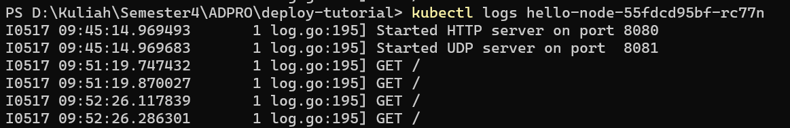

# advprog-module11

## Reflection 1

1. Ya, benar terdapat perubahan pada log tiap kali saya membuka aplikasi

berikut adalah screenshot dari log yang saya dapatkan:

2. Tujuan penggunaan `-n` adalah untuk menggunakan namespace. Dengan menggunakan namespace, kita dapat membatasi akses ke resources yang ada di dalam cluster. Alasan output tidak menyebutkan pods/service adalah karena namespace digunakan pada kube-system, bukan default.

## Reflection 2

1. Rolling Update secara bertahap menggantikan instansi versi lama dari suatu aplikasi dengan versi baru. Selama Rolling Update, versi lama dan baru dari aplikasi bisa berjalan bersamaan untuk beberapa waktu. Metode ini bertujuan untuk memastikan bahwa layanan tetap tersedia dan mampu melayani permintaan bahkan selama pembaruan.

Strategi Recreate menghapus semua instansi versi lama dari aplikasi sebelum menerapkan instansi versi baru. Ini berarti ada periode di mana aplikasi tidak tersedia antara penghentian versi lama dan penerapan versi baru.

2. Saya menerapkan recreate deployement strategy dengan menikuti link berikut: https://dev.to/cloudskills/kubernetes-deployment-strategy-recreate-3kgn .

3. File terlampir pada deployment-latest.yaml

4. Berkas manifest mendefinisikan kondisi yang diinginkan untuk deployment, termasuk jumlah replika, gambar kontainer, sumber daya, dan lainnya. Keuntungan dari pendekatan ini termasuk kecepatan pelaksanaan, karena hanya perlu menjalankan perintah kubectl apply -f untuk menerapkannya. Selain itu, menyimpan berkas manifest sangat sesuai untuk digunakan dengan Git, karena perubahan pada berkas tersebut mudah untuk dilihat dan mendukung kerja sama tim.